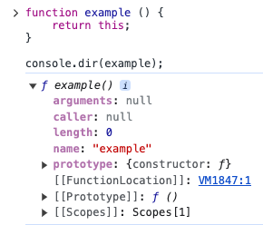
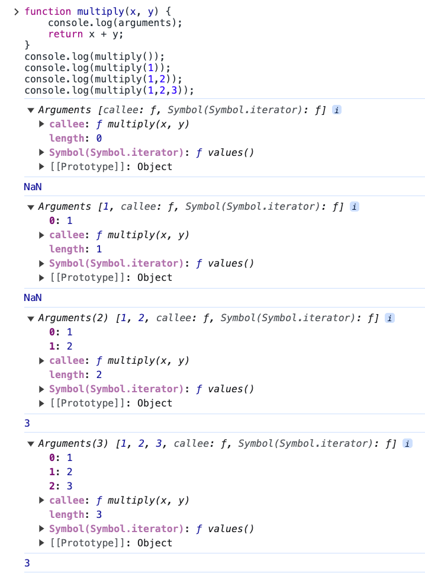

# 모딥다 18장. 함수와 일급 객체

## 18.1 일급 객체

아래의 4가지 조건을 만족하는 객체를 **일급 객체**라 한다.

1. 무명의 리터럴로 생성할 수 있다. 즉, 런타임에 생성이 가능하다. (함수 표현식의 함수 리터럴은 런타임에 평가되어 함수 객체를 생성한다.)
2. 변수나 자료구조(객체, 배열 등)에 저장할 수 있다.
3. 함수의 매개변수에 전달할 수 있다. (콜백 함수 등)
4. 함수의 반환값으로 사용할 수 있다. (고차 함수 등)

자바스크립트의 함수는 위의 4가지 조건을 모두 만족하므로 일급 객체이다.

```js
// 1. 함수는 무명의 리터럴로 생성할 수 있다.
// 2-1. 함수는 변수에 저장할 수 있다.
const increase = function (num) {
  return ++num;
};

const decrease = function (num) {
  return --num;
};

// 2-2. 함수는 객체에 저장할 수 있다.
const predicates = { increase, decrease };

// 3. 함수의 매개변수에 전달할 수 있다.
// 4. 함수의 반환값으로 사용할 수 있다.
function makeCounter(predicate) {
  let num = 0;

  return function () {
    num = predicate(num);
    return num;
  };
}

// 3. 함수는 매개변수에게 함수를 전달할 수 있다.
const increaser = makeCounter(predicates.increase);
const decreaser = makeCounter(predicates.decrease);
console.log(increaser()); // 1
console.log(decreaser()); // -1
```

- 함수는 일급 객체이다.
  - 따라서 함수를 객체와 동일하게 사용할 수 있다.
  - 객체는 값 이다. 따라서 함수 또한 값 과 동일하게 취급 가능하다.
  - 즉 값을 사용 할 수 있는 모든 곳에서 함수를 리터럴로 정의 가능하며, 런타임에 함수 객체로 평가된다.
    - 변수 할당문
    - 객체의 프로퍼티 값
    - 배열의 요소
    - 함수 호출의 인수
    - 함수의 반환문

함수는 객체이지만, 일반 객체와는 다른 두가지 차이가 있다. 함수는 호출할 수 있고, 일반 객체에는 없는 함수 객체만의 고유한 프로퍼티(`arguments`, `caller`, `length`, `name`, `prototype`)를 소유한다.

## 18.2 함수 객체의 프로퍼티

함수도 객체이므로 프로퍼티를 소유할 수 있다.

- 함수 고유의 프로퍼티
  - `arguments`
  - `caller` (비표준)
  - `length`
  - `name`
  - `prototype`
- 일반 객체와 공통으로 갖는 프로퍼티
  - `constructor`
  - `__proto__` (`Object.prototype` 객체를 상속받는다.)



- 주의: 화살표 함수, ES6 메서드 축약 표현은 `prototype` 프로퍼티를 소유하지 않는다.

### 18.2.1 arguments 프로퍼티

- 함수 객체 `arguments` 프로퍼티 값은 함수 호출 시 전달된 인수들의 정보를 담고 있는 유사 배열 객체인 `arguments` 객체이다.
- `arguments` 객체는 함수 내부에서 지역 변수처럼 사용된다. 따라서 함수 외부에서 참조할 수 없다.
- 함수 객체의 `arguments` 프로퍼티는 ES3부터 표준에서 폐지되었으므로, `Function.arguments` 와 같이 접근하는 대신 함수 내부에서 지역 변수처럼 사용 가능한 `arguments` 객체를 참조하도록 한다.
- `arguments` 객체는 매개변수 개수를 확정할 수 없는 가변 인자 함수를 구현할 때 유용하다.
- 자바스크립트는 함수의 매개변수와 인수의 개수 일치 여부를 확인하지 않기 때문에 매개변수 개수만큼 인수를 전달하지 않아도 에러가 발생하지 않는다.
  - 인수가 적으면 전달되지 않은 매개변수는 `undefined`로 초기화된다.
  - 인수가 많으면 초과된 인수는 무시된다. 이 때 초과된 인수가 그냥 버려지지는 않으며, 모든 인수는 암묵적으로 `arguments` 객체의 프로퍼티로 보관된다.

```js
function multiply(x, y) {
  console.log(arguments);
  return x + y;
}
console.log(multiply()); // NaN
console.log(multiply(1)); // NaN
console.log(multiply(1, 2)); // 3
console.log(multiply(1, 2, 3)); // 3
```



- `arguments` 객체의 프로퍼티 값 : 인수
- `arguments` 객체의 프로퍼티 키 : 인수의 인덱스
- `arguments` 객체의 `callee` 프로퍼티 : 호출되어 `arguments` 객체를 생성한 함수 (함수 자신)
- `arguments` 객체의 `length` 프로퍼티 : 인수의 개수
- `arguments` 객체의 `Symbol(Symbol.iterator)` 프로퍼티 : `arguments` 객체를 순회 가능한 자료구조인 이터러블로 만들기 위한 프로퍼티

#### arguments 객체 활용 예시 - 매개변수 개수를 확정할 수 없는 가변 인자 함수 구현

자바스크립트가 매개변수와 인수의 개수 일치 여부를 확인하지 않기 때문에, 함수 호출 시 인수 개수에 따라 다르게 동작해야 하는 함수의 경우에 `arguments` 객체를 유용하게 활용할 수 있다.

```js
function sum() {
  let res = 0;

  // arguments 객체는 length 프로퍼티가 있는 유사 배열 객체이므로 for 문으로 순회할 수 있다.
  // 하지만 유사 배열 객체이므로 배열 메서드를 사용하면 에러가 발생한다.
  // 배열 메서드를 사용하려면 Function.prototype.call/apply/bind 메서드에 의해 간접 호출해야 하는 번거로움이 있다.
  for (let i = 0; i < arguments.length; i++) {
    res += arguments[i];
  }

  return res;
}

console.log(sum()); // 0
console.log(sum(1, 2)); // 3
console.log(sum(1, 2, 3)); // 6
```

`arguments` 객체는 배열이 아니라 유사 배열 객체이므로, 배열 메서드를 사용하면 에러가 발생한다. 배열 메서드를 사용하려면 Function.prototype.call/apply/bind 메서드에 의해 간접 호출해야 하는 번거로움이 있다.
물론 이러한 번거로움을 피하기 위해 ES6 Rest 파라미터를 사용하면 배열 메서드를 사용할 수 있다.

```js
function sum(...args) {
  console.log(Array.isArray(args)); // true
  return args.reduce((pre, cur) => pre + cur, 0);
}
console.log(sum(1, 2)); // 3
```

### 18.2.2 caller 프로퍼티

- `caller` 프로퍼티는 함수 자신을 호출한 함수를 가리킨다.
- ECMAScript 사양에 포함되지 않은 비표준 프로퍼티이다. 이후 표준화될 예정도 없기 때문에 참고로만 정리하도록 함.

```js
function foo(func) {
  return func();
}

function bar() {
  return `caller: ${bar.caller}`;
}

// 브라우저 환경 실행결과 (노드 환경은 모듈이므로 결과가 다름)
console.log(foo(bar)); // caller: function foo(func) { return func(); }
console.log(bar()); // caller: null
```

### 18.2.3 length 프로퍼티

함수 객체의 `length` 프로퍼티는 함수의 매개변수의 개수를 가리킨다.
`arguments` 객체의 `length` 프로퍼티와 혼동하지 않도록 주의한다.
함수 객체의 `length` 프로퍼티는 매개변수의 개수이고, `arguments` 객체의 `length` 프로퍼티는 인수의 개수이다.

```js
function foo(x, y) {
  const 매개변수개수 = foo.length;
  const 인수개수 = arguments.length;
  console.log(`매개변수: ${매개변수개수}개, 인수: ${인수개수}개`);
}
console.log(foo(1, 2, 3)); // 매개변수: 2개, 인수: 3개
```

### 18.2.4 name 프로퍼티

함수 객체의 `name` 프로퍼티는 함수 이름을 나타낸다. 함수 객체를 가리키는 식별자를 프로퍼티 값으로 갖는다. ES6 이전까지 비표준이었다가 ES6에서 표준으로 채택되었기 때문에 익명 함수 표현식의 `name` 프로퍼티는 ES5와 ES6 이후의 동작이 다르므로 주의해야 한다.

```js
// 기명 함수 표현식
var namedFunc = function foo() {};
console.log(namedFunc.name); // foo

// 익명 함수 표현식
var anonymousFunc = function () {};
// ES5: 익명 함수 표현식의 name 프로퍼티 값이 빈 문자열이다.
// ES6: 익명 함수 표현식의 name 프로퍼티 값이 함수 객체를 가리키는 변수 이름이다.
console.log(anonymousFunc.name); // anonymousFunc

// 함수 선언문
function bar() {}
console.log(bar.name); // bar
```

### 18.2.5 `__proto__` 접근자 프로퍼티

### 18.2.6 prototype 프로퍼티
